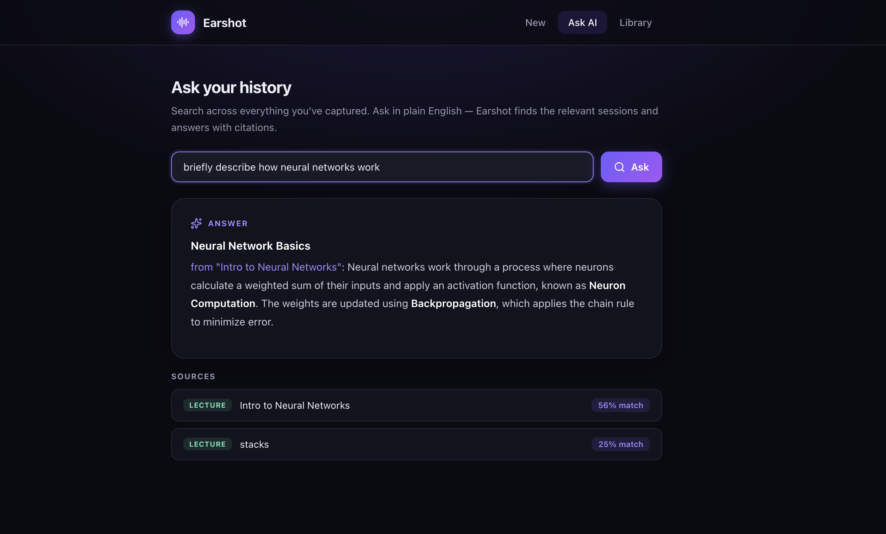

# Earshot — NLP for Spoken-Audio Transcripts

**An NLP pipeline for semantic search, retrieval-augmented Q&A, and summarization over
meeting, lecture, podcast, and interview transcripts.**

Earshot turns spoken audio into a searchable knowledge base. This repo's core is a Python/NLP
pipeline that embeds transcripts, retrieves the most relevant sessions by **cosine similarity**, and
answers natural-language questions over your history (RAG). A TF-IDF baseline is benchmarked against
dense sentence embeddings, with extractive summarization and keyphrase extraction on top.

> 📓 **Start here:** [`notebooks/nlp_pipeline.ipynb`](notebooks/nlp_pipeline.ipynb) — the full
> pipeline end-to-end, with rendered plots, an evaluation table, and a RAG walkthrough.

---

## The NLP pipeline

```
transcript ──► preprocess ──►  vectorize  ──► cosine-similarity ──► rank ──► summarize / answer
              (clean,          ├─ TF-IDF        retrieval
               tokenize,       │  (sparse baseline)
               lemmatize)      └─ MiniLM embeddings
                                  (dense, 384-d)
```

| Stage | Technique | Module |
|---|---|---|
| Preprocessing | tokenization, stopword removal, lemmatization (NLTK) | [`nlp/preprocess.py`](nlp/preprocess.py) |
| Sparse retrieval | TF-IDF (unigrams + bigrams), scikit-learn | [`nlp/vectorizers.py`](nlp/vectorizers.py) |
| Dense retrieval | `all-MiniLM-L6-v2` sentence embeddings | [`nlp/embeddings.py`](nlp/embeddings.py) |
| Ranking / search | cosine similarity, unified `search(query, k)` | [`nlp/search.py`](nlp/search.py) |
| Summarization | embedding-based **TextRank** (graph centrality) | [`nlp/summarize.py`](nlp/summarize.py) |
| Keyphrases | per-session TF-IDF keyterms | [`nlp/keywords.py`](nlp/keywords.py) |
| Evaluation | Hit@1 · Precision@k · MRR | [`nlp/evaluate.py`](nlp/evaluate.py) |
| RAG chunking | overlapping passage windows | [`nlp/data.py`](nlp/data.py) |

---

## What the notebook shows

1. **Corpus EDA** — mode distribution, transcript lengths, word cloud.
2. **Preprocessing** — raw text → cleaned, lemmatized tokens.
3. **TF-IDF baseline** — sparse vectors + interpretable top terms.
4. **Dense embeddings** — 384-dim MiniLM vectors.
5. **TF-IDF vs. embeddings** — semantic search demos on paraphrased queries.
6. **Evaluation** — Hit@1 / P@k / MRR comparison on a hand-labeled query set.
7. **Embedding-space viz** — PCA & t-SNE projections clustering by topic/mode.
8. **Extractive summarization** — TextRank over sentence embeddings.
9. **Keyphrase extraction** — auto-tagging each session.
10. **RAG walkthrough** — retrieve passages and assemble the context fed to the LLM.

**Key finding:** dense embeddings retrieve correctly even when the query shares *no exact words* with
the transcript (vocabulary mismatch), where the TF-IDF baseline degrades — the motivation for using
sentence embeddings in the live app.

---

## Run it

```bash
python3 -m venv .venv
source .venv/bin/activate
pip install -r requirements.txt

# build (if needed) and execute the notebook
jupyter nbconvert --to notebook --execute --inplace notebooks/nlp_pipeline.ipynb
# ...or just open it:
jupyter lab notebooks/nlp_pipeline.ipynb
```

First run downloads the `all-MiniLM-L6-v2` model (~90 MB) and a few NLTK data files.

### Use the package directly

```python
from nlp import data, search, evaluate

df = data.load_sessions()
index = search.SemanticIndex(
    df["document"].tolist(),
    df[["sessionId", "title", "mode"]].to_dict("records"),
    method="dense",          # or "tfidf"
)
for r in index.search("how do neural networks learn?", k=3):
    print(r.score, r.meta["title"])

metrics, by_query = evaluate.evaluate_index(index, k=3)
print(metrics)               # {'hit@1': ..., 'P@3': ..., 'MRR': ...}
```

---

## Dataset

[`data/sessions.json`](data/sessions.json) — 11 sessions across all four modes (lecture, meeting,
podcast, interview). Each has a transcript and a structured summary, tagged `captured` (real
recordings made with the demo app) or `sample` (added so the corpus spans every mode).

---

## Project layout

```
data/        sessions.json — the transcript corpus
nlp/         the NLP package (preprocess, vectorizers, embeddings, search, summarize, keywords, evaluate)
notebooks/   nlp_pipeline.ipynb — the end-to-end notebook
app/         interactive demo: React frontend + Express backend (see below)
```

---

## Interactive demo app

The pipeline also ships as a working web app under [`app/`](app/): it captures any browser tab's
audio (Meet, Zoom, YouTube…), transcribes it live with Whisper, writes a mode-aware summary, embeds
each session **on-device**, and lets you ask questions across your history with cited answers.



```bash
# backend  (needs a free GROQ_API_KEY for Whisper transcription + LLaMA summaries)
cd app/backend && npm install && cp .env.example .env && npm run dev

# frontend
cd app/frontend && npm install && npm run dev
```

| Layer | Tech |
|---|---|
| Frontend | React 19, Vite |
| Backend | Node.js, Express 5 |
| Transcription | Groq Whisper (`whisper-large-v3-turbo`) |
| Summaries & RAG answers | Groq LLaMA 3.3 70B |
| Embeddings | `all-MiniLM-L6-v2` via transformers.js — runs **locally**, no API key |

The app's retrieval (`app/backend/services/embeddings.js`) and the Python `nlp` package use the same
model and the same cosine-similarity ranking — the notebook is the analysis-grade version of what the
app does at runtime.
