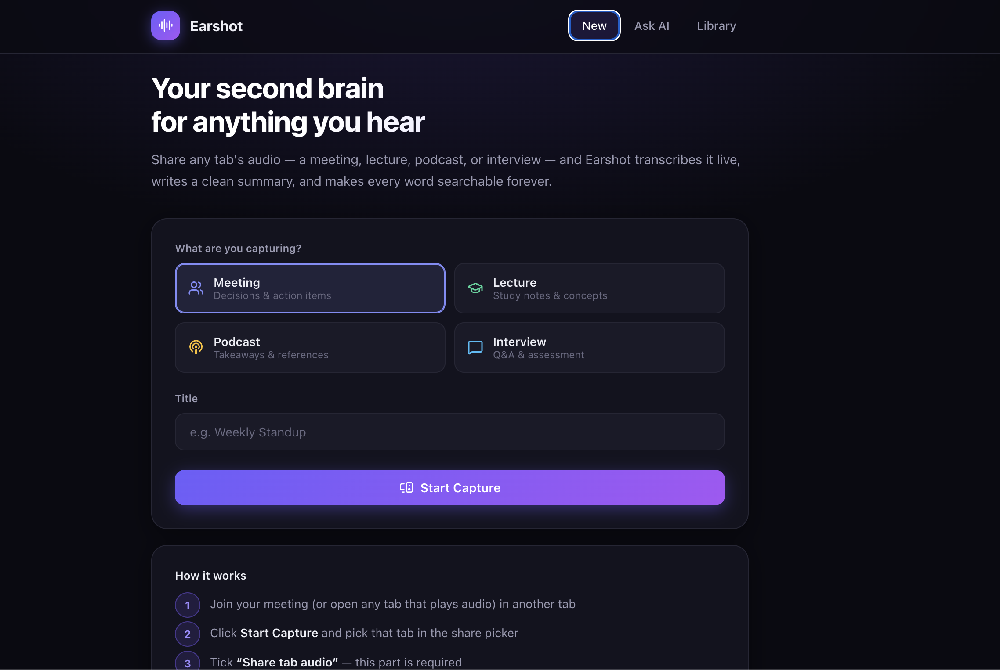
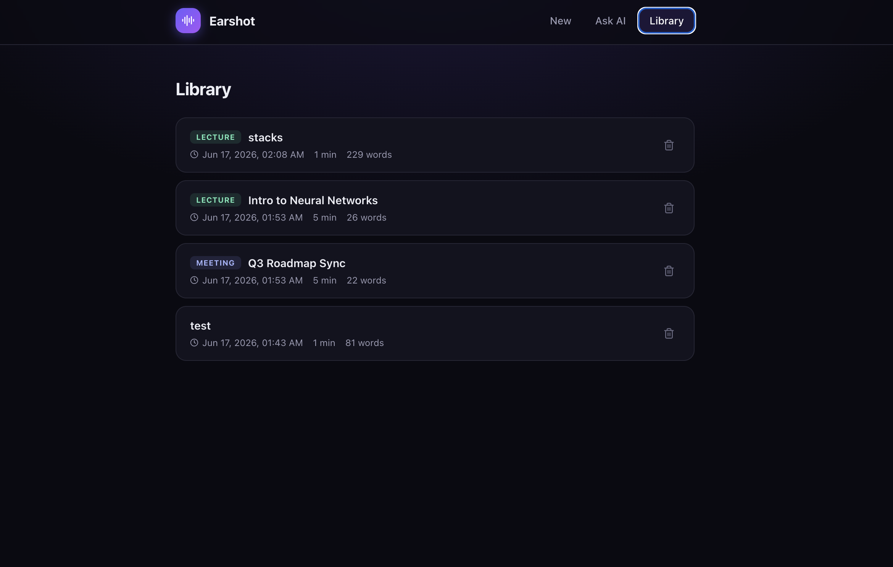

# Earshot

**Your second brain for anything you hear.**

Earshot captures the audio from any browser tab — a meeting, lecture, podcast, or interview — transcribes it live, writes a structured AI summary, and makes every session **semantically searchable forever**. Ask it questions in plain English and it answers from your entire history, with citations.

> No bot to install in your meeting, no Google login, no screen-recording software. Just share a tab's audio and Earshot does the rest.



---

## Features

- 🎧 **Capture any tab's audio** — works with Google Meet, Zoom (web), YouTube, or anything that plays sound, via the browser's `getDisplayMedia` API.
- ⚡ **Live transcription** — audio is streamed in 15-second slices to [Groq Whisper](https://groq.com) and captions appear in near real time.
- 🧠 **Mode-aware summaries** — pick *Meeting*, *Lecture*, *Podcast*, or *Interview* and the summary structure adapts (decisions & action items vs. study notes vs. takeaways, etc.).
- 🔎 **Ask your history (RAG)** — every session is embedded with an **on-device** model and stored. Ask a question and Earshot retrieves the most relevant sessions and synthesizes a cited answer.
- 💾 **Zero-config storage** — saves to MongoDB if configured, otherwise to a local JSON file. Nothing else to set up.

---

## Screenshots

**Ask your history** — semantic search retrieves the most relevant sessions and answers with citations.


**Library** — every captured session, tagged by type and saved for later.



---

## How it works

```
                         ┌──────────────────────────────────────────────┐
   Browser tab audio     │                  Frontend (React)            │
   (Meet / Zoom / etc.)  │   getDisplayMedia → record 15s webm chunks   │
            │            └───────────────┬──────────────────────────────┘
            ▼                            │  POST /audio (chunk)
   ┌─────────────────┐                   ▼
   │ MediaRecorder   │        ┌──────────────────────────────────────────┐
   │ 15s webm/opus   │        │              Backend (Express)           │
   └─────────────────┘        │                                          │
                              │  Groq Whisper  ──►  live transcript      │
            Stop ───────────► │  Groq LLaMA 3.3 ─►  mode-aware summary   │
                              │  all-MiniLM-L6-v2 ► 384-dim embedding    │
                              │            │                             │
                              │            ▼   stored (Mongo / JSON)     │
                              │  /search:  embed query → cosine rank →   │
                              │            LLaMA answer w/ citations     │
                              └──────────────────────────────────────────┘
```

**The pipeline, end to end:** browser tab audio → MediaRecorder chunks → Whisper transcription → LLaMA summarization → local embedding → in-memory vector search → retrieval-augmented Q&A.

---

## Tech stack

| Layer | Tech |
|---|---|
| Frontend | React 19, Vite, `react-markdown`, `lucide-react` |
| Backend | Node.js, Express 5, Multer |
| Transcription | Groq Whisper (`whisper-large-v3-turbo`) |
| Summarization & RAG answers | Groq LLaMA 3.3 70B |
| Embeddings | `all-MiniLM-L6-v2` via [transformers.js](https://github.com/xenova/transformers.js) — runs **locally**, no API key |
| Vector search | In-memory cosine similarity |
| Storage | MongoDB (optional) with automatic local-JSON fallback |

A note on the embeddings: they run entirely **on-device** with a small (~25 MB) model that's downloaded and cached on first use. There's no external embedding API, no key, and no per-request cost — making semantic search free and private.

---

## Getting started

### Prerequisites

- **Node.js 18+**
- A **free [Groq API key](https://console.groq.com)** (used for both transcription and summarization)
- A **Chromium-based browser** (Chrome or Edge) — these reliably support sharing *tab audio*, which is the one thing Earshot needs.

### 1. Backend

```bash
cd backend
npm install
cp .env.example .env        # then add your GROQ_API_KEY
npm run dev                 # starts on http://localhost:3001
```

`MONGODB_URI` is optional — leave it blank and summaries save to `backend/summaries.json`.

### 2. Frontend

```bash
cd frontend
npm install
npm run dev                 # starts on http://localhost:5173
```

### 3. Use it

1. Join your meeting (or open any tab that plays audio) in a separate tab.
2. In Earshot, pick a **mode**, give it a **title**, and click **Start Capture**.
3. In the browser's picker, choose that tab **and tick "Share tab audio"** (required).
4. Watch captions stream in. Click **Stop & Summarize** when you're done.
5. Later, open the **Ask AI** tab and ask questions across everything you've captured.

---

## Project structure

```
backend/
  index.js                 Express API (sessions, audio, stop, search)
  services/
    transcriber.js         Groq Whisper transcription
    summarizer.js          Mode-aware summaries + RAG answer synthesis
    embeddings.js          On-device embeddings + cosine search
    storage.js             MongoDB with local-JSON fallback
frontend/
  src/
    App.jsx                Single-page UI (capture, transcript, summaries, Ask AI)
    api.js                 API client
```

---

## Configuration

| Variable | Where | Required | Purpose |
|---|---|---|---|
| `GROQ_API_KEY` | backend | ✅ | Whisper transcription + LLaMA summaries/answers |
| `MONGODB_URI` | backend | — | Persistent storage (falls back to local JSON) |
| `PORT` | backend | — | Backend port (default `3001`) |
| `VITE_API_URL` | frontend | — | Backend URL (default `http://localhost:3001`) |

Secrets live in `.env` files, which are git-ignored. Never commit real keys — use the provided `.env.example` templates.

---

## Notes & limitations

- **Tab audio capture** is best supported in Chrome/Edge on desktop; Safari and Firefox have limited support.
- Transcription quality depends on the audio; Whisper occasionally mishears proper nouns — the summarizer is prompted to infer intent.
- Chunked transcription (15s windows) can split a sentence across captions; this is a deliberate latency trade-off for live feedback.

## Possible future work

- Speaker diarization (who said what)
- Auto chapters and timestamps
- Export to Notion / PDF
- Swap in a dedicated vector database as history grows
